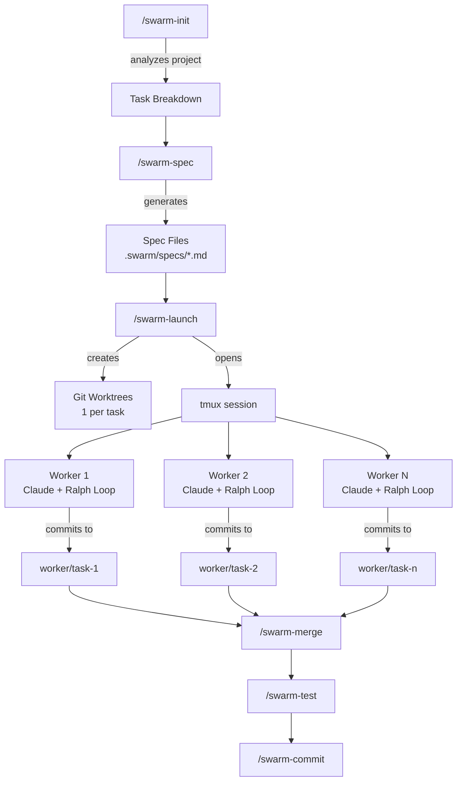

# Claude Swarm

**Parallel Claude Code agents, orchestrated through slash commands.**

Divide large coding missions into isolated tasks, launch a worker swarm in tmux, and merge the results — all without leaving your Claude Code session.

> One `/swarm-init`, one `/swarm-launch`, walk away. Come back to merged branches.

---

## How it works

```
┌─────────────────────────────────────────────────────────────────┐
│                       YOUR TERMINAL                             │
│                                                                 │
│  you> /swarm-init "Build auth, dashboard, and API"              │
│       Claude analyzes codebase, proposes 3 tasks                │
│                                                                 │
│  you> /swarm-spec                                               │
│       Claude writes detailed specs per task                     │
│                                                                 │
│  you> /swarm-launch                                             │
│       ┌───────────┬───────────┬───────────┐                     │
│       │ Worker 1  │ Worker 2  │ Worker 3  │  ← tmux panes       │
│       │ auth-ui   │ dashboard │ api-crud  │                     │
│       │ ✅ Done   │ 🟡 Work   │ 🟡 Work   │                     │
│       └───────────┴───────────┴───────────┘                     │
│       Each worker: own git branch + own worktree                │
│       Ralph loop keeps them going until done                    │
│                                                                 │
│  you> /swarm-status    ← check progress anytime                 │
│  you> /swarm-merge     ← merge completed branches               │
│  you> /swarm-test      ← QA in the browser                      │
│  you> /swarm-commit    ← structured commit message, push        │
└─────────────────────────────────────────────────────────────────┘
```

Each worker is an isolated Claude Code instance running in its own **git worktree** on its own **branch**. Workers follow a spec, commit incrementally, and signal when done. A [Ralph Wiggum](https://ghuntley.com/ralph/) stop hook re-injects the mission prompt each time a worker tries to stop before finishing.

---

## Install

**One-liner:**

```bash
git clone https://github.com/DDX1/claude-swarm.git ~/.claude-swarm && ~/.claude-swarm/install.sh
```

**Or from a local clone:**

```bash
git clone https://github.com/DDX1/claude-swarm.git ~/projects/claude-swarm
~/projects/claude-swarm/install.sh
```

The installer shows a preview of what it will do, asks once for confirmation, then creates symlinks from `~/.claude/` into the repo. Existing files are backed up automatically. Updates are just `git pull`.

### Prerequisites

| Tool | Required | Install |
|------|----------|---------|
| [Claude Code](https://docs.anthropic.com/en/docs/claude-code) | yes | `npm install -g @anthropic-ai/claude-code` |
| [git](https://git-scm.com/) | yes | `xcode-select --install` (macOS) / `apt install git` |
| [tmux](https://github.com/tmux/tmux) | yes | `brew install tmux` (macOS) / `apt install tmux` |

---

## Commands

| Command | Arguments | What it does |
|---------|-----------|--------------|
| `/swarm-init` | `"mission description"` | Analyze project, propose task breakdown, create `.swarm/` structure |
| `/swarm-spec` | *(optional: task to refine)* | Deep-dive codebase, generate per-worker spec files in `.swarm/specs/` |
| `/swarm-launch` | | Create git worktrees + tmux session, start Claude in each pane |
| `/swarm-status` | | Report worker status: ✅ Done / 🟡 Working / 🔴 Blocked / ⚪ Stalled |
| `/swarm-merge` | | Review diffs, merge completed worker branches one-by-one |
| `/swarm-stop` | | Kill tmux session, preserve worker branches |
| `/swarm-test` | | Spawn QA agent to verify merged features end-to-end |
| `/swarm-commit` | | Generate structured commit summarizing all swarm work |

### Optional extras (not auto-installed)

These are included in the repo but not installed by default to avoid conflicts with your existing setup:

| Extra | What it does | Opt-in |
|-------|-------------|--------|
| `commit-msg` skill | `/commit` — structured git commit messages | `ln -sfn ~/.claude-swarm/skills/commit-msg ~/.claude/skills/commit-msg` |
| `COMMANDS.md` | Full command reference doc | `cat ~/.claude-swarm/config/COMMANDS.md` |

---

## Quick start

```bash
# 1. Open any project in Claude Code
cd ~/my-project
claude

# 2. Define the mission
> /swarm-init "Build user auth, admin dashboard, and REST API"

# 3. Generate detailed specs for each worker
> /swarm-spec

# 4. Launch the swarm — workers start automatically
> /swarm-launch

# 5. Watch workers in real time
tmux attach -t swarm
# Ctrl+B + arrows  → switch panes
# Ctrl+B + z       → zoom into one pane
# Ctrl+B + d       → detach (swarm keeps running)

# 6. Check progress without attaching
> /swarm-status

# 7. Merge completed branches
> /swarm-merge

# 8. Test everything in the browser
> /swarm-test

# 9. Generate a structured commit
> /swarm-commit

# 10. Stop workers if still running
> /swarm-stop
```

---

## Architecture



### Key concepts

**Git worktrees** — Each worker gets its own copy of the repo via `git worktree add`. They share the same `.git` directory but operate in isolated directories. No worker can interfere with another.

**Ralph loop** — When Claude tries to stop before completing its task, the stop hook intercepts and re-injects the mission prompt. The worker sees its own previous commits and continues iterating. Exits only when the completion signal is found.

**Spec-driven workers** — Each worker reads a precise spec file with explicit scope (files to create, modify, read, and never touch). This prevents scope creep and file conflicts between workers.

**Completion signals** — Workers signal completion by writing to `.claude/.worker-done` and outputting `<promise>TASK_SLUG_COMPLETE</promise>`. The stop hook checks for this before allowing Claude to exit.

---

## Repo structure

```
claude-swarm/
├── commands/          8 slash commands (.md files)
├── scripts/           5 bash orchestration scripts
├── templates/         4 worker configuration templates
├── skills/            commit-msg skill
├── config/            COMMANDS.md reference, CLAUDE.md example
├── docs/              Architecture, customization, troubleshooting
├── install.sh         Installer (symlinks into ~/.claude/)
└── uninstall.sh       Clean removal
```

### What gets installed where

| Repo source | Symlinked to | Notes |
|---|---|---|
| `commands/swarm-*.md` | `~/.claude/commands/` | One symlink per file. Only `swarm-` prefixed — won't touch your other commands. |
| `scripts/` | `~/.claude/swarm/scripts` | Directory symlink |
| `templates/` | `~/.claude/swarm/templates` | Directory symlink |

**Not auto-installed:** `skills/commit-msg/`, `config/COMMANDS.md` — see [Optional extras](#optional-extras-not-auto-installed).

---

## Updating

```bash
cd ~/.claude-swarm && git pull
```

That's it. Symlinks point to the repo, so changes take effect immediately.

## Verifying

```bash
~/.claude-swarm/install.sh --check
```

## Uninstalling

```bash
~/.claude-swarm/install.sh --uninstall
```

Removes all symlinks. Offers to restore backed-up files. Leaves your project `.swarm/` directories untouched.

---

## Customization

Commands are markdown files — edit them to change behavior. Templates control how worker prompts are generated. See [docs/customization.md](docs/customization.md) for details.

## Troubleshooting

| Problem | Solution |
|---------|----------|
| tmux session won't start | Check `tmux` is installed and no existing `swarm` session: `tmux kill-session -t swarm` |
| Workers stop immediately | The Ralph stop hook must be configured. Check `~/.claude/swarm/templates/worker-settings.json` |
| Merge conflicts | Expected when workers touch overlapping files. Redesign your task breakdown for better isolation. |

See [docs/troubleshooting.md](docs/troubleshooting.md) for more.

---

## Credits

- [Ralph Wiggum technique](https://ghuntley.com/ralph/) by Geoffrey Huntley
- [Claude Code](https://docs.anthropic.com/en/docs/claude-code) by Anthropic
- [ralphy](https://github.com/michaelshimeles/ralphy) by Michael Shimeles — inspiration for the loop engine

## License

[MIT](LICENSE)
